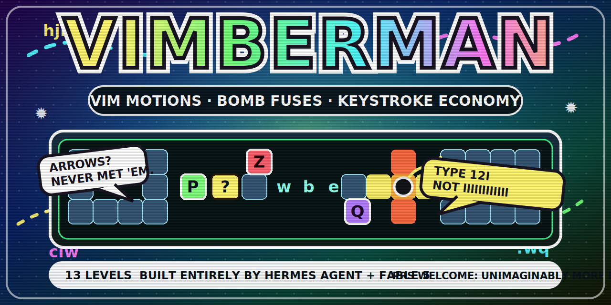

<p align="center">
  <a href="https://mikeldking.github.io/vimberman/">
    
  </a>
</p>

<p align="center">
  <a href="https://mikeldking.github.io/vimberman/"><strong>▶ Play Vimberman</strong></a>
  ·
  <a href="https://github.com/mikeldking/vimberman">GitHub</a>
  ·
  <a href="docs/README.md">Design docs</a>
  ·
  <a href="docs/mechanics.md">Mechanics</a>
  ·
  <a href="docs/level-design.md">Level design</a>
</p>

<p align="center">
  <a href="https://github.com/mikeldking/vimberman/actions/workflows/pages.yml"></a>
  <a href="https://mikeldking.github.io/vimberman/"></a>
  
  
</p>

# VIMBERMAN

<<<<<<< HEAD
**Vim motions. Bomb fuses. Keystroke economy.**

Vimberman is a browser-based Bomberman-like where every move is a Vim command.
You do not walk with arrow keys and place bombs with spacebar; you survive by
using `hjkl`, counts, word motions, find motions, line jumps, edits, and undo as
an arcade input language.

The world advances **one tick per completed command**. Twelve taps of `l` give
the zombies twelve turns. `12l` gives them one. Vim's editing philosophy — move
farther, with fewer keys — becomes the difference between a clean escape and a
very educational explosion.

Built entirely with **Hermes Agent** and **Fable 5**. PRs are extremely welcome:
bring weird levels, meaner enemies, better juice, sillier jokes, and anything
that makes the game **unimaginably more fun**.

> Bombs · zombies · and the world's most portable skill.
=======
A Bomberman-like for the browser where every move is a vim motion. Eighteen
levels that teach vim progressively — from `hjkl` to `ciw` and `Ctrl-u` —
under bomb fuses, keystroke budgets, and enemies that move only when you type.
Motions are Metroid-style powerups: collect a keycap `?` to add its motion to
your vocabulary, permanently.
>>>>>>> d2e3178 (Checkpoint: story arc, motions v2, arsenal, and four new levels)

## Play

- **Live game:** <https://mikeldking.github.io/vimberman/>
- **Source:** <https://github.com/mikeldking/vimberman>
- **Design reference:** [`docs/README.md`](docs/README.md)

The published build is deployed by GitHub Actions from `main` to GitHub Pages.

## At a glance

| Feature | What it means |
|---|---|
| **13 puzzle-action levels** | A compact campaign that teaches Vim progressively, from `hjkl` to `ciw` and `Ctrl-u`/`Ctrl-d`. |
| **Turn-based on keystrokes** | Every completed command advances enemies, bombs, hazards, and fuses by one tick. Counts are survival tech. |
| **Bombs from editing** | Stand on a code tile, enter terminal mode with `i`, fix a broken word using real Vim edits, then drop the armed bomb with `x`. |
| **Metroid-style motion unlocks** | Keycap pickups permanently add motion groups to your vocabulary. You learn by needing the new tool. |
| **Deterministic enemies** | Seeded RNG makes every retry play the same way: solve it like a puzzle, execute it like a speedrun. |
| **Golf scoring** | Each level has a hard key budget and a par target for 3-star clears. |
| **Pure engine, browser UI** | TypeScript engine logic is DOM-free and tested separately from the Vite/canvas UI. |

## How it plays

- **Move with Vim, not arrows.** `h`, `j`, `k`, `l` step one tile; counts like
  `5l` or `3j` slide multiple tiles as one world turn.
- **Hop words and find letters.** `w`, `b`, `e`, `f{char}`, `t{char}`, `;`, and
  `,` become flight paths over gaps, enemies, and trap layouts.
- **Edit to arm bombs.** Code tiles open a one-line Vim-ish terminal where `x`,
  `r`, `~`, `s`, `cw`, and `ciw` repair broken identifiers into `bomb`.
- **Undo is a resource.** `u` rewinds one world tick — even death — but charges
  are limited and explosions erase history.
- **Read the terminal.** The gutter behaves like `relativenumber`, the statusline
  echoes pending keys, and the ruler helps you count like a real Vim user.

## Controls / motion vocabulary

| Keys | Effect |
|---|---|
| `h j k l` | Step left/down/up/right. Bonking a wall still costs a turn. |
| `5l`, `3j`, ... | Counted motion: travel many tiles for one enemy tick. |
| `w` `b` `e` | Hop between word starts/ends on lettered tiles; flight crosses gaps and enemies. |
| `f{c}` `F{c}` `t{c}` `T{c}` | Dash along a row to, or just before, character `{c}`. |
| `;` `,` | Repeat or reverse the last find/till motion. |
| `0` `$` | Snap to the start/end of the current row. Excellent when a linter row goes hot. |
| `gg` `G` | Slam to the top/bottom of the current column. |
| `i` | Open the code tile underfoot and enter terminal-editing mode. |
| `x` | Drop an armed bomb in the world; delete a character in terminal mode. |
| `u` | Rewind one tick if you have undo charges. |
| `Ctrl-u` `Ctrl-d` | Ride an updraft into the cloud layer / drop back down. |
| `:` | Open ex commands: `:help`, `:map`, `:hint`, `:q`, `:q!`. |

## The world

The dungeon is source code with teeth:

- `▒` soft rocks crumble under any blast.
- `▓` hard rocks need a widened blast radius.
- `~` gaps stop walking but not word/find flight motions.
- `‹ › ˄ ˅` one-way tiles turn routes into commitments.
- `*` bushes hide key budget, undo, bomb, and radius pickups.
- `?` keycaps unlock motion families.
- `:` code tiles are broken identifiers waiting to become bombs.
- `E` is the glowing exit portal.

The bestiary is tuned to punish inefficient editing:

| Enemy / hazard | Role |
|---|---|
| **Zombie `Z`** | Half-speed chaser. It loves wasted keystrokes. |
| **Imp `&`** | Drops bombs of its own. Bait it into mining rocks or fragging friends. |
| **Toad `Q`** | Hops over pits; flight motions flip it onto its back for a squash bonus. |
| **Mage `M`** | Teleports on a readable cycle and fires down rows/columns. Never idle aligned. |
| **Linter `!`** | Row-sweeping hazard with warning phases. Margins and `0`/`$` are your friends. |

## Project map

| Path | Role |
|---|---|
| [`src/levels.ts`](src/levels.ts) | 13 levels as ASCII maps, terminals, bushes, keycaps, sky layers, budgets, and solution scripts. |
| [`src/engine/`](src/engine/) | Pure game logic: motions, terminals, bombs, AI, undo, deterministic ticks. No DOM. |
| [`src/render/sprites.ts`](src/render/sprites.ts) | Procedural 16×16 pixel-art sprite atlas, validated by tests. |
| [`src/render/renderer.ts`](src/render/renderer.ts) | Canvas renderer: animation, tweening, particles, shake, glow, gutter, ruler. |
| [`src/ui/`](src/ui/) | Menus, HUD/statusline, save state, terminal editor, WebAudio synth hooks. |
| [`docs/`](docs/) | Design docs for premise, mechanics, bestiary, level design, UI/UX, architecture, and v2 systems. |

## Design docs

Start here if you want to understand or extend the game:

1. [`docs/premise.md`](docs/premise.md) — the pitch, tone, audience, and design pillars.
2. [`docs/mechanics.md`](docs/mechanics.md) — rulebook for movement, bombs, undo, items, win/fail states.
3. [`docs/bestiary.md`](docs/bestiary.md) — enemies, AI roles, and tuning intent.
4. [`docs/level-design.md`](docs/level-design.md) — curriculum, par/budget tuning, level curve.
5. [`docs/ui-ux.md`](docs/ui-ux.md) — CRT shell, HUD/statusline, onboarding, audio, juice.
6. [`docs/architecture.md`](docs/architecture.md) — engine/UI split, determinism, save format, test strategy.
7. [`docs/new-mechanics.md`](docs/new-mechanics.md) — toads, linter rows, gutter/ruler, cloud layer.
8. [`docs/progression-and-juice.md`](docs/progression-and-juice.md) — unlocks, hints, scoring, command line.

## Development

Requirements: Node.js 22+ is what CI uses.

```sh
npm install
npm run dev        # Vite dev server with HMR
npm run build      # strict typecheck + production build into dist/
npm run preview    # serve the production build locally
npm test           # vitest: solvability, engine rules, UI smoke, sprite atlas
```

<<<<<<< HEAD
Useful one-offs:
=======
### GitHub Pages

The repo deploys itself: `.github/workflows/pages.yml` typechecks, runs the
level-solver + engine + UI tests on every push to `main`, then builds and
publishes `dist/` to Pages. One-time setup: repo
**Settings → Pages → Source → GitHub Actions**.

## How it plays

- **Turn-based on your keystrokes.** Every completed command is one world tick:
  enemies step, fuses burn. Twelve presses of `l` give the zombies twelve moves;
  `12l` gives them one. Keystroke economy is literally survival.
- **Keystroke budget.** Each level has a hard budget and a par. Beat par for
  3 stars. Run dry and the cursor grows still.
- **Bombs come from editing.** Stand on a code-tile `:` and press `i` to open
  it, then fix the broken word (`bmob` → `bomb`) with real vim edits —
  `x`, `r`, `~`, `s`, `cw`, `ciw`. A correct word arms a bomb; drop it with `x`
  and get out of the plus-shaped blast.
- **`u` is your lives.** Undo rewinds one world tick — even death — but charges
  are scarce and no undo crosses an explosion.

### Motions

| Keys | Effect |
|---|---|
| `h j k l` | step (bonking a wall still costs a turn) |
| `5l`, `3j`… | counted motion — many tiles, one enemy turn |
| `w` `b` `e` | hop between words of lettered tiles, soaring over gaps and enemies |
| `f{c}` `F{c}` `t{c}` `T{c}` `;` `,` | dash along the row to letter `{c}` |
| `0` `$` `gg` `G` | slide to row/column ends, sweeping up items |
| `Ctrl-u` `Ctrl-d` | ride an updraft into the cloud layer / drop back down |
| `i` | edit the code-tile underfoot |
| `x` | drop an armed bomb |
| `u` | rewind one tick |
| `:` | free ex command line — `:help` `:map` `:hint` `:q` `:q!` |

Flying over a **toad** (`w`/`e`/`f`…) flips it helpless for six turns; walk
onto a flipped toad to squash it for +2 budget. The playfield reads like a
buffer with `relativenumber`: the gutter counts rows for you (see 4 → type
`4j`), the ruler counts columns, and a pending count lights up its landing
tiles.

### The world

Boulders bomb open · steel blocks need a widened blast · starfield gaps can
only be jumped by `w`/`f` motions · chevron one-way tiles only admit you moving
that direction · bushes hide items (keystrokes, bomb radius, undo charges,
extra bombs) · the glowing portal is the exit. Everything is rendered from a
procedural 16×16 pixel-art sprite atlas — zombies shamble, bombs spark, the
mage telegraphs its teleport with a rune circle.

### The bestiary

- **Zombie `Z`** — half-speed chaser. Punishes wasted keystrokes.
- **Imp `&`** — drops its own bombs. Its blasts open rocks too; bait it into
  mining for you, or into fragging its friends.
- **Toad `Q`** — hops two tiles every third turn, clearing pits. Walking
  can't shake it; a flight motion over it flips it onto its back.
- **Mage `M`** — teleports on a readable 5-turn cycle and fires bolts down its
  row and column. Never linger aligned with the rune.
- **The linter `!`** — not a creature, a hazard: sweeps its whole row on a
  six-turn cycle (three dark, two amber, then fire). Only the margins `|` at
  the row ends are safe — `0` and `$` snap you to them from anywhere.

Some enemies patrol fixed lanes; the free-roamers hunt.

## Architecture

TypeScript throughout (strict mode), bundled by Vite. The engine stays pure —
no DOM — and notifies the UI through overridable `fx` hooks.

| Path | Role |
|---|---|
| `src/levels.ts` | 18 levels as ASCII maps + terminals, bushes, keycaps, linters, sky layers, budgets |
| `src/engine/` | pure game logic — motions, terminals, bombs, AI, undo. No DOM. |
| `src/render/sprites.ts` | procedural pixel-art atlas: 16×16 sprites as validated character grids |
| `src/render/renderer.ts` | canvas draw loop: sprite animation, tweening, particles, shake, glow |
| `src/ui/` | screens/menus, HUD + statusline, WebAudio synth, saves, code-tile editor |
| `src/main.ts` | boot — wires fx hooks to sound and view effects |

Enemies use a seeded RNG, so every level plays identically on every retry —
plan like a puzzle, execute like a speedrun.

## Tests
>>>>>>> d2e3178 (Checkpoint: story arc, motions v2, arsenal, and four new levels)

```sh
npx tsc --noEmit   # typecheck only
npx vite --host    # dev server visible on your LAN
```

## Tests and guarantees

The tests are part of the design, not just safety rails:

- `test/solve.test.ts` replays hand-authored keystroke scripts through the real
  engine. Par is achievable by proof, and alternate routes must fit the budget.
- `test/engine.test.ts` pins core movement, bonk, blast, hard-rock, and undo
  rules.
- `test/ui-smoke.test.ts` boots the app against a stub DOM and clears level 1
  through the real keydown handler.
- `test/sprites.test.ts` validates every sprite-grid in the procedural atlas.

Progress saves to `localStorage` under `vimberman.save.v1`.

## Deployment

`.github/workflows/pages.yml` runs on every push to `main`:

1. `npm ci`
2. `npx tsc --noEmit`
3. `npm test`
4. `npm run build`
5. Upload `dist/` to GitHub Pages

The Pages URL is the canonical playable build:

<https://mikeldking.github.io/vimberman/>

## Contributing notes

Vimberman was built entirely with **Hermes Agent** and **Fable 5**, and the door
is wide open for more chaos. PRs are welcome — especially PRs that make the game
**unimaginably more fun**: new levels, absurd enemies, sharper tutorials,
better juice, tastier sound, funnier terminal copy, smarter tests, or wild ideas
that somehow still fit the Vim/Bomberman premise.

Vimberman works best when every addition preserves the core contract:

1. **Every keystroke is a decision.** No filler input.
2. **Teach by doing.** One new trick should become load-bearing in the level that introduces it.
3. **Efficiency is the score.** Budgets and pars should reward Vim fluency, not real-time reflexes.
4. **Determinism makes it a puzzle.** If randomness changes retries, seed it and test it.
5. **Fiction and mechanic should be the same object.** If a feature needs a paragraph of lore to justify it, simplify it.

If you add a level, add or update a solver route so the CI proves it can be won.

## Status

Playable browser prototype with a tested 13-level campaign, procedural sprite
atlas, CRT canvas UI, GitHub Pages deployment, and design docs. The repo is
ready for level iteration, balancing, polish, and more mean little Vim jokes.
