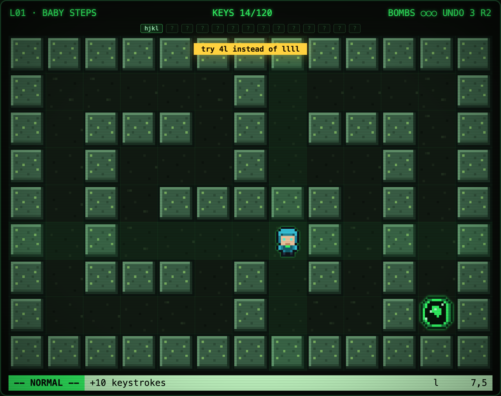
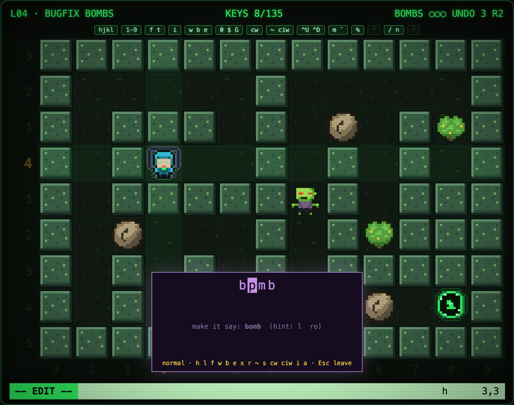
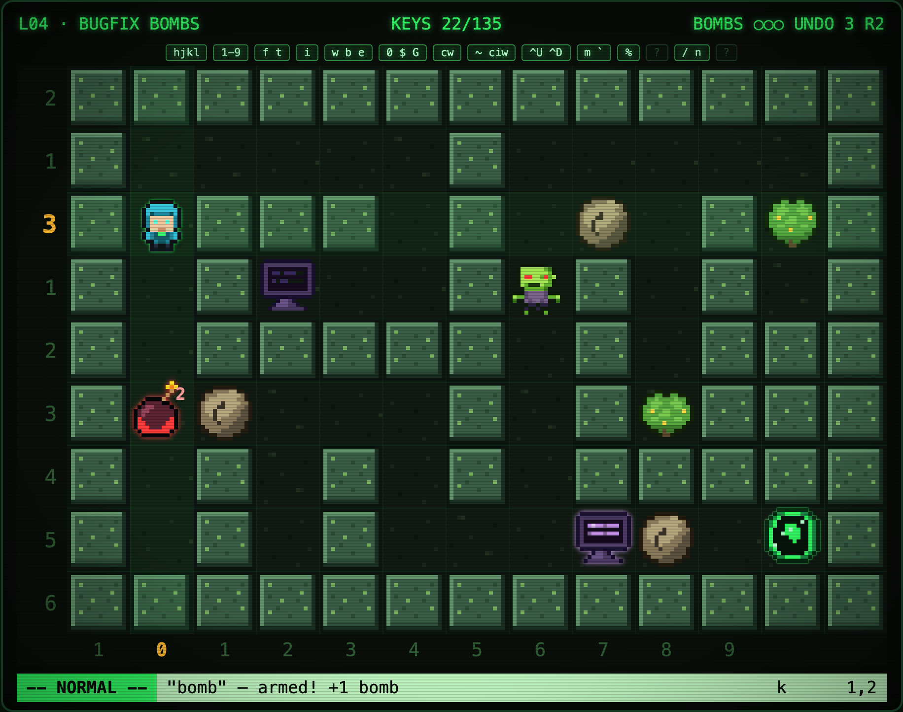
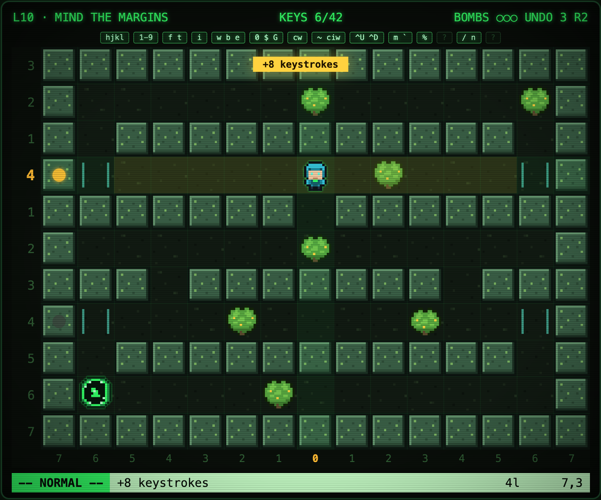
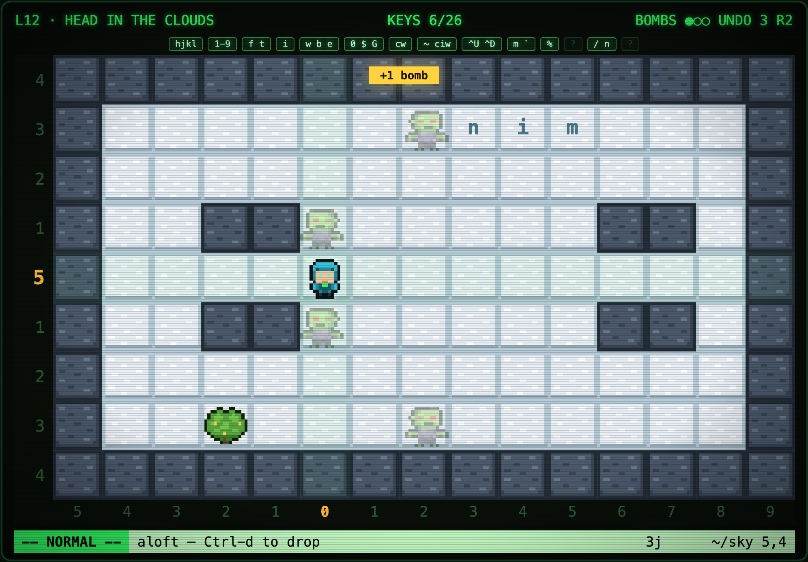

<p align="center">
  <a href="https://mikeldking.github.io/vimberman/">
    
  </a>
</p>

<p align="center">
  <strong><a href="https://mikeldking.github.io/vimberman/">▶ PLAY NOW — free, in your browser, no install</a></strong>
</p>

<p align="center">
  <a href="docs/README.md">Design docs</a>
  ·
  <a href="docs/mechanics.md">Mechanics</a>
  ·
  <a href="docs/level-design.md">Level design</a>
  ·
  <a href="CONTRIBUTING.md">Contributing</a>
</p>

<p align="center">
  <a href="https://github.com/mikeldking/vimberman/actions/workflows/pages.yml"></a>
  <a href="https://mikeldking.github.io/vimberman/"></a>
  
  
  <a href="LICENSE"></a>
  <a href="CONTRIBUTING.md"></a>
</p>

# VIMBERMAN

**The world only moves when you type. Type better.**

Vimberman is a browser Bomberman-like where every move is a Vim command. No
arrow keys. No spacebar. You survive with `hjkl`, counts, word hops, find
motions, real edits, and undo — and the world advances **one tick per
completed command**. Twelve taps of `l` give the zombies twelve turns. `12l`
gives them one.

That's the whole game: Vim's editing philosophy — *move farther with fewer
keys* — becomes the difference between a clean escape and a very educational
explosion. By the final level you're setting marks, bouncing off `%`,
searching with `/`, and recording macros to solve puzzles. Congratulations:
you accidentally learned the world's most portable skill.

<p align="center">
  <a href="https://mikeldking.github.io/vimberman/">
    
  </a>
  <br>
  <em>The game coaches you toward fluency. Rudely, if necessary.</em>
</p>

## Why you'll get hooked

- **Turn-based on your keystrokes.** Enemies, fuses, and hazards move only
  when you complete a command. It's chess where the clock is your WPM in Vim.
- **Bombs come from editing.** Stand on a code tile, press `i`, and fix the
  broken word — `bpmb` → `bomb` — with real Vim edits (`x`, `r`, `~`, `s`,
  `cw`, `ciw`). A correct word arms a bomb. Drop it with `x`. Now run.
- **Motions are Metroid powerups.** Keycap pickups `?` permanently add motion
  families to your vocabulary. You learn `f` because a gap is uncrossable
  without it, not because a tutorial said so.
- **Undo is your lives.** `u` rewinds one world tick — even death — but
  charges are scarce and no undo crosses an explosion.
- **Golf scoring.** Every level has a hard keystroke budget and a par for the
  3-star clear. Deterministic, seeded enemies make every retry identical:
  plan like a puzzle, execute like a speedrun.

## Screenshots

| | |
|:---:|:---:|
|  |  |
| *Fix `bpmb` with real Vim edits to arm a bomb* | *…then get out of the plus-shaped blast* |
|  |  |
| *The linter sweeps its row — `0` and `$` save lives* | *`Ctrl-u` rides an updraft into the cloud layer* |

## The 19-level curriculum

The difficulty curve **is** a Vim curriculum. Each level makes exactly one
new trick load-bearing:

<details>
<summary><strong>Spoiler: the full campaign</strong></summary>

| # | Level | Teaches |
|---:|---|---|
| 01 | BABY STEPS | `h j k l` |
| 02 | COUNT THE CORRIDORS | counts: `10l` `6j` |
| 03 | LEAP OF FAITH | `f F t ;` — dash, stop short, repeat |
| 04 | BUGFIX BOMBS | `i x r` — edit words, earn bombs |
| 05 | WORD BRIDGES | `w b e` — hop between words |
| 06 | THE LONG WAY | `0 $ gg G` — slam across lines |
| 07 | FLIP THE SCRIPT | flight flips toads |
| 08 | REWRITE THE RULES | `cw` — change a whole word |
| 09 | AGAINST THE CURRENT | one-way tiles — commit or route around |
| 10 | MIND THE MARGINS | `0 $` — anchors when the row goes hot |
| 11 | WARPED WORDS | `~` and `ciw` — case flips, inner words |
| 12 | HEAD IN THE CLOUDS | `Ctrl-u Ctrl-d` — the sky layer |
| 13 | CUMULUS GOLF | kites — flight cuts the string |
| 14 | BOOKMARKED | `m{a}` `` `{a} `` — bookmarks |
| 15 | BALANCED BRACKETS | `%` — jump to the matching bracket |
| 16 | GREP | `/{word}` `n` — search the whole file |
| 17 | THE FINAL REFACTOR | everything — and a merciless budget |
| 18 | BABY STEPS, PROMOTED | worn keys — lead with a count |
| 19 | AUTOMATE YOURSELF | `q @` — record and replay macros |

</details>

## Controls / motion vocabulary

| Keys | Effect |
|---|---|
| `h j k l` | Step. Bonking a wall still costs a turn. |
| `5l`, `3j`, … | Counted motion: many tiles, one enemy tick. |
| `w` `b` `e` | Hop between words of lettered tiles, soaring over gaps and enemies. |
| `f{c}` `F{c}` `t{c}` `T{c}` `;` `,` | Dash along the row to (or just before) character `{c}`; repeat, reverse. |
| `0` `$` `gg` `G` | Slam to row/column ends, sweeping up items on the way. |
| `m{a}` `` `{a} `` | Drop a mark, teleport back to it. |
| `%` | Bounce between paired bracket doors. |
| `/{word}` `n` | Search the level; `n` jumps to the next hit. |
| `q{a}` `@{a}` | Record a macro, replay it — one tick per replayed command. |
| `Ctrl-u` `Ctrl-d` | Ride an updraft into the cloud layer / drop back down. |
| `i` | Open the code tile underfoot: one-line Vim terminal, real edits. |
| `x` | Drop an armed bomb (in the world) / delete a char (in the terminal). |
| `u` | Rewind one world tick — even death. Charges are precious. |
| `:` | Ex commands: `:help` `:map` `:hint` `:q` `:q!` |

The playfield reads like a buffer with `relativenumber`: the gutter counts
rows for you (see a 4 in the gutter → type `4j`), the ruler counts columns,
and a pending count lights up its landing tiles.

## The bestiary

The dungeon is source code with teeth, tuned to punish inefficient editing:

| Enemy / hazard | Role |
|---|---|
| **Zombie `Z`** | Half-speed chaser. It loves wasted keystrokes. |
| **Imp `&`** | Drops its own bombs. Bait it into mining rocks — or fragging its friends. |
| **Toad `Q`** | Hops pits every third turn. Fly over it (`w`, `f`…) to flip it; squash for a bonus. |
| **Mage `M`** | Teleports on a readable cycle, fires down rows and columns. Never idle aligned. |
| **Kite `Y`** | Sky-native. Any flight motion that crosses its string cuts it down. |
| **The linter `!`** | Not a creature — a hazard. Sweeps its whole row on a cycle; only the margins survive. `0` and `$` are one keystroke from anywhere. |
| **The flytrap** | Lives in level 12's shadows. That's all you get. |

Boulders bomb open · steel needs a widened blast · starfield gaps only yield
to flight motions · chevron tiles are one-way commitments · bushes hide
budget, bombs, radius, and undo charges · keycaps `?` unlock motions · the
glowing portal is the exit.

## Run it locally

Requirements: Node.js 22+ (what CI uses).

```sh
git clone https://github.com/mikeldking/vimberman.git
cd vimberman
npm install
npm run dev        # Vite dev server with HMR
```

Other useful commands:

```sh
npm test           # vitest: solvability proofs, engine rules, UI smoke, sprites
npm run build      # strict typecheck + production build into dist/
npm run preview    # serve the production build locally
```

## How it's built

TypeScript throughout (strict), bundled by Vite, zero runtime dependencies.
The engine is pure logic — no DOM — and notifies the UI through overridable
`fx` hooks. Everything you see is a procedural 16×16 pixel-art sprite atlas
drawn to a canvas with a CRT shell.

| Path | Role |
|---|---|
| [`src/levels.ts`](src/levels.ts) | 19 levels as ASCII maps + terminals, bushes, keycaps, linters, sky layers, budgets |
| [`src/engine/`](src/engine/) | Pure game logic: motions, terminals, bombs, AI, undo, deterministic ticks |
| [`src/render/sprites.ts`](src/render/sprites.ts) | Procedural pixel-art atlas — every sprite is a validated character grid |
| [`src/render/renderer.ts`](src/render/renderer.ts) | Canvas draw loop: animation, tweening, particles, shake, glow |
| [`src/ui/`](src/ui/) | Menus, HUD/statusline, WebAudio synth, saves, the code-tile editor |
| [`docs/`](docs/) | The full design bible — premise, mechanics, bestiary, levels, story, architecture |

The tests are part of the design, not just safety rails:

- [`test/solve.test.ts`](test/solve.test.ts) replays hand-authored keystroke
  scripts through the real engine — **every level ships with a machine-checked
  proof that par is achievable**.
- [`test/engine.test.ts`](test/engine.test.ts) pins movement, bonk, blast,
  and undo rules.
- [`test/ui-smoke.test.ts`](test/ui-smoke.test.ts) boots the app against a
  stub DOM and clears level 1 through the real keydown handler.
- [`test/sprites.test.ts`](test/sprites.test.ts) validates every sprite grid
  in the atlas.

Progress saves to `localStorage`. Deploys ship automatically:
[`pages.yml`](.github/workflows/pages.yml) typechecks, tests, builds, and
publishes to GitHub Pages on every push to `main`.

## Contributing

Vimberman was built entirely with **Hermes Agent** and **Fable 5**, and the
door is wide open for more chaos. PRs are welcome — especially ones that make
the game **unimaginably more fun**: new levels, absurd enemies, sharper
tutorials, better juice, tastier sound, funnier terminal copy, wilder ideas
that somehow still fit the Vim/Bomberman premise.

The core contract, from [CONTRIBUTING.md](CONTRIBUTING.md):

1. **Every keystroke is a decision.** No filler input.
2. **Teach by doing.** A new trick becomes load-bearing in the level that introduces it.
3. **Efficiency is the score.** Budgets reward Vim fluency, not reflexes.
4. **Determinism makes it a puzzle.** If randomness changes retries, seed it and test it.
5. **Fiction and mechanic are the same object.** If a feature needs a paragraph of lore, simplify it.

If you add a level, add a solver route so CI proves it can be won. If you
enjoy the game, consider [sponsoring](https://github.com/sponsors/mikeldking)
— it buys more levels and meaner little Vim jokes.

## License

[MIT](LICENSE). Take the bombs. Learn the motions. Share both.
